# 🗓️ Career Timeline (Mermaid Visualization)

```mermaid
gantt
    title Terry Teppo – Career Timeline (1989–2025)
    dateFormat  YYYY-MM
    axisFormat  %Y

    section Training & Education
    SIMA Naval Technical Training       :active, sima,       1989-01, 1990-12
    Business Degree & ITIL              :education,          2009-01, 2009-12
    Microsoft + Security Certs          :securitytrain,      2021-01, 2023-12

    section Early Career
    Foundation Roles & MS Training      :earlyit,            1990-01, 1996-05

    section Primary Career Milestones
    SCF of Arizona – Sr. Admin          :scf,                1996-06, 2011-04
    AMEX via IBM – Scripting Engineer   :amexibm,            2011-05, 2013-01
    Isaksson Lumber – Yard Ops          :yardboss,           2015-05, 2018-09
    formaeld – Test Driver              :formaeld,           2019-01, 2019-03
    HCL – IT CSR                        :hclcsr,             2020-12, 2023-04
    Enbridge – Support Technician       :enbridge,           2023-04, 2025-06
```

---

### 📌 Notes:
- This Mermaid block will render automatically in GitHub's Markdown viewer and your GitHub Pages site.
- You can adjust the section labels, colors, or durations using `crit`, `active`, or `done` for styling.
- Place this inside your `timeline.md` or feature it directly on your portfolio homepage.

Would you like me to bundle a Projects graph next? Or format a multi-track layout showing certifications vs. job experience side-by-side? This kind of visualization adds serious polish to your presentation.
